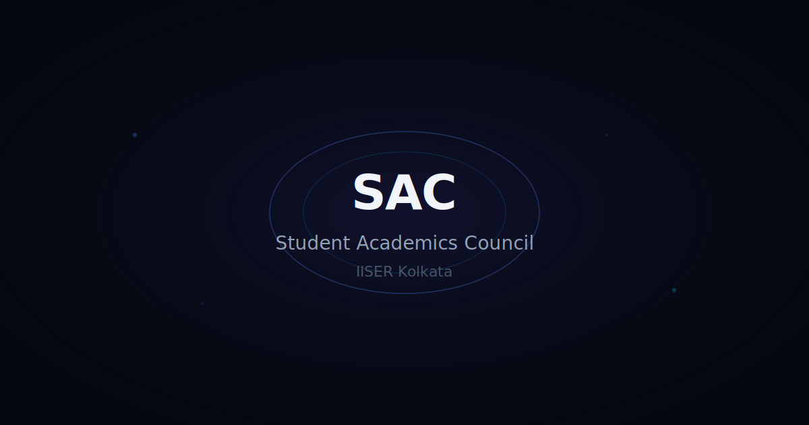

# SAC IISER Kolkata — Official Website



[](LICENSE)


The **Student Academics Council (SAC)** at **IISER Kolkata** official website — a performant, cinematic, and accessible static website showcasing academic clubs, events, and student initiatives.

> **Design Direction:** _"Deep Space Academia"_ — dark, sophisticated, scientific. Feels like looking at the cosmos through the lens of rigorous scholarship.

---

## 📁 Tech Stack

| Library                                                                   | Description                                       |
| ------------------------------------------------------------------------- | ------------------------------------------------- |
| [**Vite**](https://vitejs.dev/)                                           | Lightning-fast build tool & dev server            |
| [**Three.js**](https://threejs.org/)                                      | 3D particle graphics for the cinematic loader     |
| [**GSAP**](https://gsap.com/)                                             | Professional-grade animation library              |
| [**GSAP ScrollTrigger**](https://gsap.com/docs/v3/Plugins/ScrollTrigger/) | Scroll-based animation triggering                 |
| [**GSAP SplitText**](https://gsap.com/docs/v3/Plugins/SplitText/)         | Character/word/line text splitting                |
| [**anime.js**](https://animejs.com/)                                      | Lightweight animation engine (typewriter effects) |
| [**Lenis**](https://github.com/darkroomengineering/lenis)                 | Smooth scroll library                             |
| [**Splitting.js**](https://splitting.js.org/)                             | Text splitting utility                            |
| [**stats.js**](https://github.com/mrdoob/stats.js)                        | FPS performance monitor (dev only)                |

---

## 🚀 Getting Started

### Prerequisites

- **Node.js** 20+ ([Download](https://nodejs.org/en/download/))
- **npm** 10+ (comes with Node.js) or **yarn** / **pnpm**

### Local Development

```bash
# 1. Clone the repository
git clone https://github.com/sac-iiserkolkata/sac-iiser-kolkata.git
cd sac-iiser-kolkata

# 2. Install dependencies
npm install

# 3. Start the dev server (http://localhost:4173)
npm run dev
```

### Available Scripts

```bash
npm run dev          # Start Vite dev server with HMR
npm run build        # Build for production (outputs to dist/)
npm run preview      # Preview production build locally
npm run test         # Run unit tests (Vitest)
npm run test:watch   # Run tests in watch mode
npm run test:e2e     # Run E2E tests (Playwright)
npm run test:perf    # Run Lighthouse CI audit
npm run lint         # Lint source files with ESLint
npm run format       # Format code with Prettier
npm run analyze      # Build with bundle analyzer (stats.html)
```

---

## 📂 Directory Structure

```
sac-iiser-kolkata/
│
├── .github/
│   └── workflows/
│       ├── deploy.yml          # GitHub Pages deployment
│       ├── test.yml            # Unit + E2E test pipeline
│       └── lighthouse-ci.yml   # Performance audit pipeline
│
├── public/
│   ├── favicon.svg             # Animated favicon
│   ├── robots.txt              # Search engine directives
│   ├── site.webmanifest        # PWA manifest
│   └── og-image.svg            # Open Graph image placeholder
│
├── src/
│   ├── assets/
│   │   ├── svgs/               # All SVG assets (logo, particle map, etc.)
│   │   ├── fonts/              # Custom font files (if self-hosted)
│   │   └── clubs/              # Club-specific assets (Phase 2 content)
│   │
│   ├── components/
│   │   ├── Loader/             # Cinematic hero loader (Three.js + GSAP)
│   │   ├── Navigation/         # Fixed glassmorphism navbar
│   │   ├── Hero/               # Post-loader hero section
│   │   ├── Clubs/              # Reusable club card component
│   │   └── shared/             # TextReveal, MagneticButton, CustomCursor
│   │
│   ├── three/                  # Three.js scene, particles, post-processing
│   │   ├── SceneManager.js
│   │   ├── ParticleSystem.js
│   │   ├── PostProcessing.js
│   │   └── shaders/            # GLSL fragment/vertex shaders
│   │
│   ├── animations/             # GSAP & anime.js animation systems
│   │   ├── timeline.js         # Master timeline orchestrator
│   │   ├── scrollAnimations.js # ScrollTrigger-based effects
│   │   ├── textAnimations.js   # Text reveal presets
│   │   └── transitions.js      # Section transition definitions
│   │
│   ├── utils/                  # Utility modules
│   │   ├── constants.js        # Global config & thresholds
│   │   ├── deviceDetect.js     # Performance tier detection
│   │   ├── lazyLoad.js         # IntersectionObserver lazy loading
│   │   └── performance.js      # FPS monitor, Core Web Vitals logging
│   │
│   ├── styles/
│   │   ├── variables.css       # Design tokens & CSS custom properties
│   │   ├── main.css            # Reset, base styles, accessibility
│   │   ├── typography.css      # Font loading, type scale, text styles
│   │   └── animations.css      # CSS keyframes, transitions
│   │
│   ├── pages/
│   │   ├── home/
│   │   │   └── index.js        # Home page entry (loaded by main.js)
│   │   └── clubs/              # Club sub-pages (Phase 2)
│   │       └── .gitkeep
│   │
│   └── main.js                 # Application entry point
│
├── tests/
│   ├── unit/                   # Vitest unit tests
│   ├── e2e/                    # Playwright E2E tests
│   └── performance/            # Lighthouse CI config
│
├── index.html                  # Vite HTML entry
├── vite.config.js              # Vite build configuration
├── vitest.config.js            # Vitest configuration
├── playwright.config.js        # Playwright E2E configuration
├── .lighthouserc.js            # Lighthouse CI budgets
├── .eslintrc.json              # ESLint rules
├── .prettierrc                 # Prettier formatting
├── .gitignore
├── package.json
└── README.md
```

---

## 🎮 Adding Club Content (Phase 2)

To add a new club:

1. Create a folder at `src/assets/clubs/<club-name>/`
2. Add the club's logo as `<club-name>.svg` or `<club-name>.png`
3. Add any banner/image assets
4. Add club text content in the designated section of `src/main.js`

```
src/assets/clubs/
├── robotics-club/
│   ├── logo.svg
│   └── banner.jpg
├── debating-society/
│   └── logo.svg
└── ...
```

The club card component (`src/components/Clubs/ClubCard.js`) accepts `name`, `description`, `icon`, `category`, and `members` fields.

---

## 🏗️ Build & Deploy

### Production Build

```bash
npm run build    # Outputs optimized files to dist/
npm run preview  # Test locally before deploying
```

### GitHub Pages Deployment

This repository is configured for **automatic deployment to GitHub Pages** via GitHub Actions:

1. Push to the `main` branch
2. The `deploy.yml` workflow builds the site and deploys to GitHub Pages
3. Access the live site at: `https://<username>.github.io/sac-iiser-kolkata/`

### Manual Deployment

```bash
npm run build
cd dist
git init
git add -A
git commit -m "Deploy"
git push -f git@github.com:<username>/sac-iiser-kolkata.git master:gh-pages
```

---

## 🧪 Testing

### Unit Tests (Vitest)

```bash
npm run test              # Run once
npm run test:watch        # Watch mode
npm run test:coverage     # With coverage report (coverage/)
```

### End-to-End Tests (Playwright)

```bash
npm run test:e2e              # Run E2E tests
npm run test:e2e -- --ui      # Interactive UI mode
```

### Performance Audit (Lighthouse CI)

```bash
npm run test:perf
```

> **Note:** Requires `LHCI_GITHUB_APP_TOKEN` as a GitHub Actions secret for PR comments.

---

## 📊 Performance Budgets

| Metric               | Target                        |
| -------------------- | ----------------------------- |
| Performance Score    | ≥ 85%                         |
| Accessibility Score  | ≥ 90%                         |
| Best Practices Score | ≥ 90%                         |
| SEO Score            | ≥ 85%                         |
| LCP                  | ≤ 2.0s (warn), ≤ 3.5s (error) |
| CLS                  | ≤ 0.1                         |
| TBT                  | ≤ 300ms (warn)                |

These budgets are enforced in CI via Lighthouse CI. Failing budgets block the PR.

### Bundle Size Targets

- Three.js chunk: < 700KB (gzipped)
- Total initial JS: < 300KB (gzipped)
- Run `npm run analyze` to inspect bundle composition

---

## 🎨 Design System

### Color Palette — _"Deep Space Academia"_

| Token                    | Value     | Usage                    |
| ------------------------ | --------- | ------------------------ |
| `--color-void`           | `#050810` | Deepest background       |
| `--color-deep`           | `#0a0f1e` | Card/section backgrounds |
| `--color-surface`        | `#111827` | Elevated surfaces        |
| `--color-primary`        | `#4f8ef7` | Primary actions, links   |
| `--color-secondary`      | `#7c3aed` | Secondary accents        |
| `--color-accent`         | `#f59e0b` | Highlights, CTAs         |
| `--color-glow`           | `#06b6d4` | Particles, loader glow   |
| `--color-text-primary`   | `#f1f5f9` | Main text                |
| `--color-text-secondary` | `#94a3b8` | Secondary text           |

### Typography Scale

| Token         | Size                                      | Usage              |
| ------------- | ----------------------------------------- | ------------------ |
| `--text-hero` | `clamp(3rem, 2rem + 5vw, 7rem)`           | Page heroes        |
| `--text-3xl`  | `clamp(2rem, 1.5rem + 2.5vw, 3rem)`       | Section headings   |
| `--text-2xl`  | `clamp(1.5rem, 1.25rem + 1.25vw, 2rem)`   | Card titles        |
| `--text-xl`   | `clamp(1.25rem, 1.1rem + 0.75vw, 1.5rem)` | Subheadings        |
| `--text-base` | `clamp(1rem, 0.9rem + 0.5vw, 1.125rem)`   | Body text          |
| `--text-sm`   | `clamp(0.875rem, 0.8rem + 0.375vw, 1rem)` | Labels, small text |

**Fonts:** Space Grotesk (headings), DM Sans (body), JetBrains Mono (code) — loaded via Google Fonts.

### Animation Tokens

| Token                 | Value                               |
| --------------------- | ----------------------------------- |
| `--duration-instant`  | 100ms                               |
| `--duration-fast`     | 200ms                               |
| `--duration-normal`   | 400ms                               |
| `--duration-slow`     | 800ms                               |
| `--duration-dramatic` | 1600ms                              |
| `--ease-out-expo`     | `cubic-bezier(0.16, 1, 0.3, 1)`     |
| `--ease-elastic`      | `cubic-bezier(0.34, 1.56, 0.64, 1)` |

---

## 🤝 Contributing

### Branch Naming

- `feat/<description>` — New features
- `fix/<description>` — Bug fixes
- `chore/<description>` — Maintenance tasks
- `docs/<description>` — Documentation updates

### PR Process

1. Create a topic branch from `main`
2. Make your changes with descriptive commits
3. Ensure all CI checks pass:
   - ✅ ESLint (zero errors)
   - ✅ Unit tests (100% passing)
   - ✅ E2E tests (all passing)
   - ✅ Lighthouse performance budgets met
4. Submit a PR with a clear description of changes
5. Request review from a maintainer

### Commit Convention

Follow [Conventional Commits](https://www.conventionalcommits.org/):

- `feat:` New feature
- `fix:` Bug fix
- `docs:` Documentation change
- `style:` Formatting, missing semicolons, etc.
- `refactor:` Code change that neither fixes a bug nor adds a feature
- `test:` Adding or updating tests
- `chore:` Maintenance tasks

---

## 🔒 Privacy & Security

This is a **fully static website** with no backend, no server, and no database. No personal data is collected or transmitted. No `.env` file is needed.

---

## 📜 License

MIT License — see [LICENSE](LICENSE) for details.

---

_Built with ♥ by SAC IISER Kolkata_
